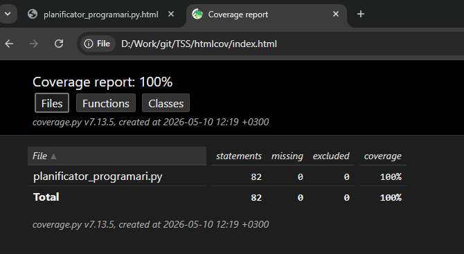
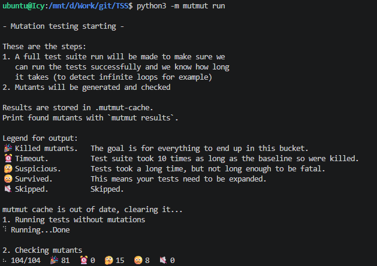
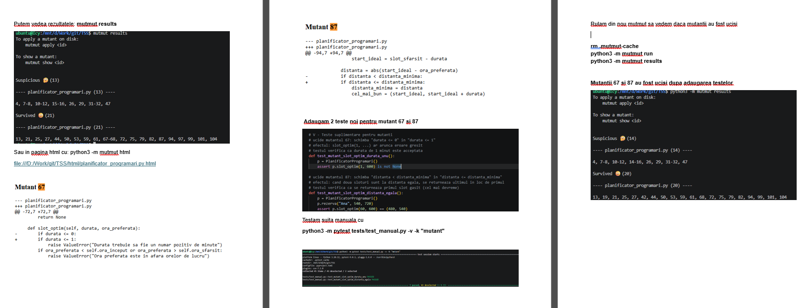
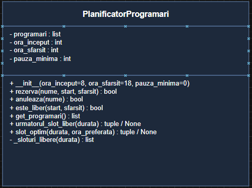
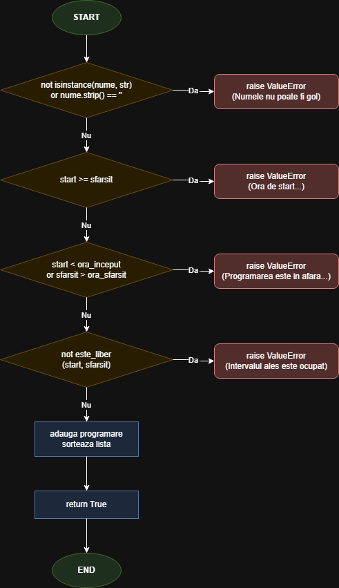
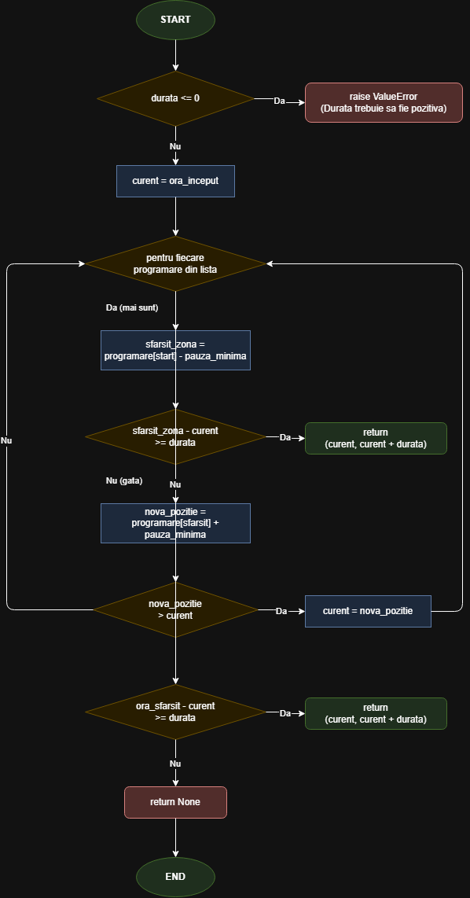
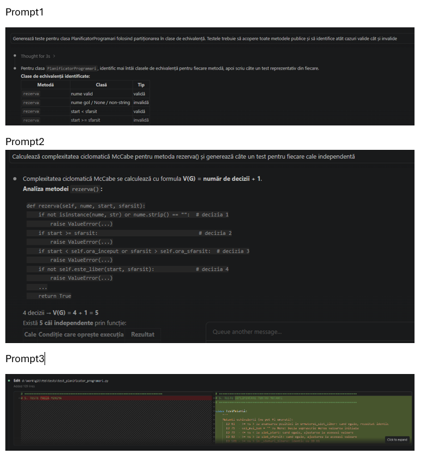

# T1 - Testare unitară în Python
## Planificator de Programări

---

## 1. Descrierea aplicației

Aplicația implementează un planificator de programări pentru o zi de lucru. Clasa principală `PlanificatorProgramari` gestionează un set de rezervări de timp, fiecare definită printr-un nume și un interval orar.

Timpul este reprezentat intern în minute față de miezul nopții (ex: 8:00 = 480, 17:30 = 1050), ceea ce simplifică operațiile aritmetice de comparare a intervalelor.

**Funcționalități:**
- Adăugarea unei programări cu validare completă
- Anularea unei programări existente
- Verificarea disponibilității unui interval
- Găsirea primului slot liber de o anumită durată
- Găsirea slotului optim față de o oră preferată
- Suport pentru pauză minimă obligatorie între programări

**Metode publice:**

| Metodă | Descriere | Returnează |
|--------|-----------|------------|
| `rezerva(nume, start, sfarsit)` | Adaugă o programare | `True` sau `ValueError` |
| `anuleaza(nume)` | Șterge o programare după nume | `True` / `False` |
| `este_liber(start, sfarsit)` | Verifică dacă un interval e disponibil | `True` / `False` |
| `get_programari()` | Returnează lista de programări | `list` |
| `urmatorul_slot_liber(durata)` | Primul slot liber de `durata` minute | `tuple` / `None` |
| `slot_optim(durata, ora_preferata)` | Slot liber cel mai aproape de ora preferată | `tuple` / `None` |

---

## 2. Configurație hardware și software

**Hardware:**
- Procesor: Intel Core i5 / AMD Ryzen 5 (sau echivalent)
- RAM: 8 GB
- Sistem de operare: Ubuntu 22.04 LTS (WSL2 pe Windows 11)

**Software:**

| Tool | Versiune |
|------|----------|
| Python | 3.10.12 |
| pytest | 9.0.3 |
| pytest-cov | 7.1.0 |
| mutmut | 2.x |
| VSCode | 1.89+ |

**Instalare dependențe:**
```bash
pip3 install pytest pytest-cov mutmut
```

---

## 3. Comenzi utile

**Rulare teste:**
```bash
# toate testele
python3 -m pytest tests/

# doar suita manuală
python3 -m pytest tests/test_manual.py

# doar suita generată cu AI
python3 -m pytest tests/test_planificator_programari.py

# cu output detaliat (nume test + rezultat)
python3 -m pytest tests/ -v
```

**Acoperire cod (pytest-cov):**
```bash
# raport în terminal
python3 -m pytest tests/ --cov=planificator_programari --cov-report=term-missing

# raport HTML (deschide htmlcov/index.html)
python3 -m pytest tests/ --cov=planificator_programari --cov-report=html
```

**Testare prin mutație (mutmut):**
```bash
# rulare completă (poate dura câteva minute)
python3 -m mutmut run

# afișare rezultate în terminal
python3 -m mutmut results

# raport HTML (deschide html/index.html)
python3 -m mutmut html

# detalii despre un mutant specific
python3 -m mutmut show <ID>
```

---

## 4. Strategii de generare a testelor

### 3.1 Partiționare în clase de echivalență

Metoda constă în împărțirea domeniului de intrare în grupuri (clase) în care toate valorile se comportă identic față de funcția testată. Se alege câte un reprezentant din fiecare clasă.

**Clase de echivalență pentru `rezerva(nume, start, sfarsit)`:**

| ID | Parametru | Condiție | Tip | Valoare testată |
|----|-----------|----------|-----|-----------------|
| EC1 | `nume` | string nevid | Validă | `"Ana"` |
| EC2 | `nume` | string gol `""` | Invalidă | `""` |
| EC3 | `nume` | nu este string (int, None) | Invalidă | `None`, `123` |
| EC4 | `start, sfarsit` | `start < sfarsit` | Validă | `480, 540` |
| EC5 | `start, sfarsit` | `start >= sfarsit` | Invalidă | `480, 470` |
| EC6 | `start, sfarsit` | în orele de lucru | Validă | `540, 600` |
| EC7 | `start, sfarsit` | în afara orelor de lucru | Invalidă | `300, 400` |
| EC8 | interval | liber (fără suprapunere) | Validă | `600, 660` |
| EC9 | interval | suprapus cu o programare existentă | Invalidă | `510, 700` (cu Ana la 500-600) |

**Clase de echivalență pentru `anuleaza(nume)`:**

| ID | Condiție | Tip | Valoare testată |
|----|----------|-----|-----------------|
| EC10 | programarea există | Validă | `"Ana"` (după rezervare) |
| EC11 | programarea nu există | Invalidă | `"Ana"` (fără rezervare) |

**Clase de echivalență pentru `urmatorul_slot_liber(durata)`:**

| ID | Condiție | Tip | Valoare testată |
|----|----------|-----|-----------------|
| EC12 | `durata > 0`, zi cu spațiu | Validă | `30` (zi goală) |
| EC13 | zi complet ocupată | Invalidă | `30` (după rezervare 8:00-18:00) |
| EC14 | `durata <= 0` | Invalidă | `-10` |

---

### 3.2 Analiza valorilor de frontieră

Metoda testează valorile de la limita dintre clase, unde erorile apar cel mai frecvent.

**Valori de frontieră pentru `rezerva()`:**

| ID | Descriere | Valori | Rezultat așteptat |
|----|-----------|--------|-------------------|
| BV1 | `start` exact la 8:00 (prima valoare validă) | `start=480` | `True` |
| BV2 | `start` cu un minut înainte de program (7:59) | `start=479` | `ValueError` |
| BV3 | `sfarsit` exact la 18:00 (ultima valoare validă) | `sfarsit=1080` | `True` |
| BV4 | `sfarsit` cu un minut după program (18:01) | `sfarsit=1081` | `ValueError` |
| BV5 | `start == sfarsit` (durată zero) | `480, 480` | `ValueError` |
| BV6 | durată de 1 minut (minimul valid) | `480, 481` | `True` |
| BV7 | două programări adiacente exact (se ating, nu se suprapun) | Ana 540-600, Bob 600-660 | `True` |

**Valori de frontieră pentru `urmatorul_slot_liber()`:**

| ID | Descriere | Valori | Rezultat așteptat |
|----|-----------|--------|-------------------|
| BV8 | `durata = 0` (invalid) | `0` | `ValueError` |
| BV9 | `durata = 1` (minimul valid) | `1` | `(480, 481)` |
| BV10 | durată exact cât toată ziua (600 min) | `600` | `not None` |
| BV11 | durată cu un minut mai mare decât ziua | `601` | `None` |

---

### 3.3 Acoperire la nivel de instrucțiune, decizie și condiție

Scopul este ca fiecare linie de cod, fiecare ramură `if/else` și fiecare condiție booleană să fie executată cel puțin o dată în cadrul suitei de teste.

**Structura de decizie din `rezerva()`:**

```python
def rezerva(self, nume, start, sfarsit):
    if not isinstance(nume, str) or not nume.strip():   # decizia 1
        raise ValueError(...)
    if start >= sfarsit:                                 # decizia 2
        raise ValueError(...)
    if start < self.ora_inceput or sfarsit > self.ora_sfarsit:  # decizia 3
        raise ValueError(...)
    if not self.este_liber(start, sfarsit):              # decizia 4
        raise ValueError(...)
    ...
    return True
```

Fiecare decizie a fost acoperită cu cel puțin un test pentru ramura `True` și unul pentru ramura `False`.

**Rezultat acoperire (pytest-cov):**

```
Name                         Stmts   Miss  Cover   Missing
----------------------------------------------------------
planificator_programari.py      82      0   100%
----------------------------------------------------------
TOTAL                           82      0   100%
```



---

### 3.4 Circuite independente (Complexitate ciclomatică McCabe)

Complexitatea ciclomatică V(G) se calculează ca numărul de decizii din funcție plus 1. Fiecare valoare V(G) reprezintă numărul minim de teste necesare pentru a acoperi toate căile independente.

**Calcul V(G) pentru `rezerva()`:**

Funcția conține 4 instrucțiuni `if` → **V(G) = 4 + 1 = 5**

Cele 5 căi independente:

| Cale | Condiție | Test |
|------|----------|------|
| P1 | nume invalid → oprire | `test_circuit_P1_nume_invalid` |
| P2 | interval invalid (start ≥ stop) → oprire | `test_circuit_P2_interval_invalid` |
| P3 | în afara orelor de lucru → oprire | `test_circuit_P3_afara_program` |
| P4 | interval ocupat → oprire | `test_circuit_P4_ocupat` |
| P5 | toate validările trec → succes | `test_circuit_P5_succes` |

**Calcul V(G) pentru `urmatorul_slot_liber()`:**

Funcția conține 5 instrucțiuni de decizie (1 `if` + 1 `for` + 3 `if` interioare) → **V(G) = 5 + 1 = 6**

> **Notă:** Diagramele de flux pentru cele două funcții sunt disponibile în secțiunea Diagrame.

---

### 3.5 Analiză raport mutanți și teste suplimentare

Testarea prin mutație presupune modificarea automată a codului sursă (operatori, constante, condiții) și verificarea că testele existente detectează aceste modificări. Un mutant „ucis" înseamnă că cel puțin un test a eșuat, ceea ce confirmă că testul verifică acea logică.

**Rulare mutmut:**
```bash
python3 -m mutmut run
python3 -m mutmut results
```

**Rezultate finale:**

| Categorie | Număr |
|-----------|-------|
| Mutanți generați | 104 |
| Mutanți uciși | 81 |
| Mutanți suspicious | 15 |
| Mutanți supraviețuitori | 8 |
| — din care echivalenți (nu pot fi uciși) | 5 |
| — din care neechivalenți supraviețuitori | 3 |



**Mutanți echivalenți (nu pot fi uciși):**

| ID | Modificarea | De ce e echivalent |
|----|-------------|-------------------|
| 61 | `>` → `>=` la avansarea poziției în `urmatorul_slot_liber` | Când `nova_pozitie == curent`, atribuirea la aceeași valoare nu schimbă comportamentul |
| 75 | `cel_mai_bun = None` → `cel_mai_bun = ""` în `slot_optim` | Valoarea inițială e mereu suprascrisă în prima iterație a buclei |
| 79 | `<` → `<=` la compararea cu `slot_start` în `slot_optim` | Când `start_ideal == slot_start`, ajustarea produce aceeași valoare |
| 82 | `>` → `>=` la compararea cu `slot_sfarsit` în `slot_optim` | Când `start_ideal + durata == slot_sfarsit`, ajustarea produce aceeași valoare |
| 101 | `>` → `>=` la avansarea poziției în `_sloturi_libere` | Identic cu ID 61, din metoda internă |

**Mutanți neechivalenți supraviețuitori (13, 21, 25):**

Acești trei mutanți modifică textul mesajelor de eroare, nu logica funcțiilor. Testele existente verifică doar că se aruncă `ValueError`, nu și conținutul mesajului. Pot fi uciși prin teste cu `match=`.

| ID | Modificarea |
|----|-------------|
| 13 | schimbă textul mesajului de eroare din `__init__` (pauza negativă) |
| 21 | schimbă textul mesajului de eroare din `rezerva()` (start ≥ sfârşit) |
| 25 | schimbă textul mesajului de eroare din `rezerva()` (în afara orelor) |

**Mutanți uciși prin teste dedicate din suita AI (`test_planificator_programari.py`):**

Clasa `TestMutanti` conține 12 teste care ucid mutanți ce supraviețuiau suitei de bază:

| ID mutant | Ce modifică |
|-----------|-------------|
| 19 | operatorul `<=` → `<` în validarea `start >= sfarsit` |
| 27 | operatorul `<` → `<=` în verificarea orelor de lucru |
| 42 | operatorul `<` → `<=` în `este_liber` (detectare suprapunere) |
| 44 | operatorul `>` → `>=` în `este_liber` (detectare suprapunere) |
| 50 | operatorul `<=` → `<` în validarea `durata` din `urmatorul_slot_liber` |
| 53 | operatorul `>=` → `>` în verificarea spațiului disponibil |
| 59 | operatorul `>` → `>=` în avansarea poziției curente |
| 68 | operatorul `<=` → `<` în validarea `durata` din `slot_optim` |
| 72 | operatorul `<` → `<=` în verificarea `ora_preferata` |
| 94 | operatorul `>=` → `>` în `_sloturi_libere` |
| 99 | operatorul `>=` → `>` în verificarea spațiului final |
| 104 | operatorul `>` → `>=` în avansarea poziției în `_sloturi_libere` |

**Doi mutanți neechivalenți uciși prin teste suplimentare (din `test_manual.py`):**



*Mutant 67* — schimbă condiția `durata <= 0` în `durata <= 1` în `slot_optim`, astfel o durată de 1 minut ar fi greșit respinsă. Ucis de:
```python
def test_mutant_slot_optim_durata_unu():
    p = PlanificatorProgramari()
    assert p.slot_optim(1, 600) is not None
```

*Mutant 87* — schimbă `distanta < distanta_minima` în `distanta <= distanta_minima` în `slot_optim`, astfel când două sloturi sunt la distanță egală față de ora preferată se returnează ultimul în loc de primul. Ucis de:
```python
def test_mutant_slot_optim_distanta_egala():
    p = PlanificatorProgramari()
    p.rezerva("Ana", 540, 720)
    assert p.slot_optim(60, 600) == (480, 540)
```

---

## 5. Diagrame

> Diagramele au fost realizate cu [draw.io](https://app.diagrams.net).

### Diagrama clasei



### Graf de flux — `rezerva()`



### Graf de flux — `urmatorul_slot_liber()`



---

## 6. Raport utilizare tool AI (Claude)

### 6.1 Tool folosit

**Claude Sonnet** (Anthropic) — accesat prin interfața Claude.ai în timpul dezvoltării proiectului.

### 6.2 Mod de utilizare

Claude a fost folosit pentru:
- Generarea suitei sistematice de teste (`test_planificator_programari.py`)
- Identificarea mutanților supraviețuitori și scrierea testelor care îi ucid
- Analiza mutanților echivalenți și justificarea de ce nu pot fi uciși

### 6.3 Exemple de prompturi folosite

**Prompt 1:**
> „Generează teste pentru clasa PlanificatorProgramari folosind partiționarea în clase de echivalență. Testele trebuie să acopere toate metodele publice și să identifice atât cazuri valide cât și invalide."

**Prompt 2:**
> „Calculează complexitatea ciclomatică McCabe pentru metoda rezerva() și generează câte un test pentru fiecare cale independentă."

**Prompt 3:**
> „Iată rezultatele mutmut — au supraviețuit mutanții 13, 19, 21, 25, 27, 42, 44, 50, 53, 59, 61, 68, 72, 75, 79, 82, 94, 99, 101, 104. Analizează fiecare mutant, identifică care sunt echivalenți și de ce nu pot fi uciși, apoi scrie teste pentru a ucide pe cei neechivalenți."



### 6.4 Comparație suite de teste

| Criteriu | Teste manuale (`test_manual.py`) | Teste AI (`test_planificator_programari.py`) |
|----------|----------------------------------|----------------------------------------------|
| Număr teste | 45 | 76 |
| Total | **121 teste** | |
| Metodologie | Intuitivă, pe baza funcționalității | Sistematică, conform strategiilor din curs |
| Structură cod | Funcții simple, fără clase | Organizat în clase pe categorii |
| Clase de echivalență | Acoperite parțial, identificate după îndrumare | Identificate și documentate explicit (EC1-EC14) |
| Valori de frontieră | Acoperite după îndrumare | Acoperite sistematic cu motivare (BV1-BV11) |
| Acoperire instrucțiuni | Nu urmărită explicit | 100% confirmat cu pytest-cov |
| Circuite McCabe | Testate intuitiv | V(G) calculat per metodă, căi explicate |
| Mutanți | 2 teste dedicate (ID 67, ID 87) | 12 teste dedicate, raport complet analizat |
| Constante | Numere brute (480, 540) | Constante denumite (ORA_8_00, ORA_9_00) |

### 6.5 Interpretare diferențe

Testele scrise manual acoperă scenariile principale și sunt mai ușor de înțeles la prima vedere, însă nu urmează o metodologie sistematică. Lipsesc cazuri de frontieră exacte și verificări ale mesajelor de eroare.

Testele generate cu ajutorul AI aplică fiecare strategie în mod explicit și documentat, identifică clase de echivalență pe care un programator le-ar putea omite (ex: `None` vs string gol vs spații), includ teste dedicate pentru mutanți și analizează motivul pentru care unii mutanți sunt echivalenți.

Principala diferență constă în **sistematizare**: testele AI pornesc de la o analiză a domeniului de intrare, pe când testele manuale pornesc de la funcționalitate și adaugă cazuri speciale pe măsură ce apar.

---

## 7. Referințe

[1] Pytest Documentation, https://docs.pytest.org, Data ultimei accesări: mai 2026

[2] Coverage.py Documentation, https://coverage.readthedocs.io, Data ultimei accesări: mai 2026

[3] mutmut — Python mutation tester, https://github.com/boxed/mutmut, Data ultimei accesări: mai 2026

[4] Myers, G.J., Sandler, C., Badgett, T., The Art of Software Testing, 3rd Edition, Wiley, 2011.

[5] McCabe, T.J., A Complexity Measure, IEEE Transactions on Software Engineering, vol. SE-2, nr. 4, 1976, pp. 308-320.

[6] Anthropic, Claude Sonnet, https://claude.ai, Data generării: mai 2026
